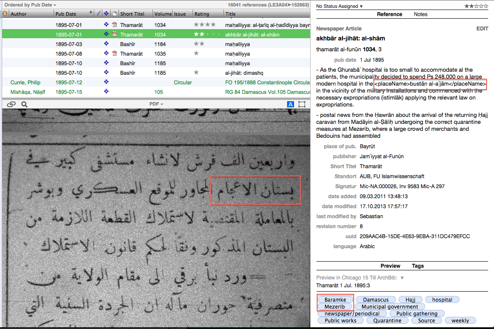
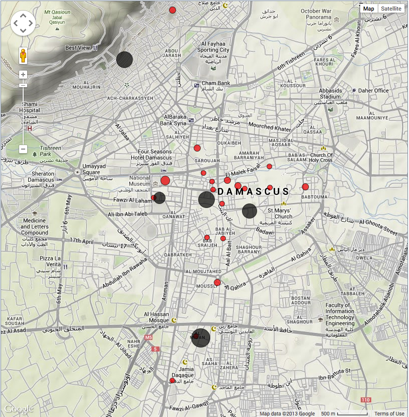

--- 
title: "Mapping Ottoman Damascus through News Reports: A practical approach" 
author: Till Grallert 
date: 2017-09-17 18:23:28 +0300 
licence: http://creativecommons.org/licenses/by-nd/4.0/
ORCID: orcid.org/0000-0002-5739-8094
DOI: doi.org/10.5281/zenodo.893613
markdown: pandoc
---

<!-- # Introduction -->
<pb n="175"/>
This paper introduces a digital workflow and a set of tools to visually scrutinize possible correlations between certain historical phenomena, discourse, and terminologies on the one hand, and geographical locations on the other by means of browser-based maps that require only minimal prior programming knowledge. The workflow provides historians with a means to quickly check whether references to certain events or certain terms within a large corpus of sources form clusters on a geographic map---as long as the information is available in a somewhat structured and machine-readable form, such as a reference or citation manager.

While the workflow can be applied to scrutinize the distribution of fires, crimes or road works, it was developed in response to a practical, methodological question of how to investigate the extent to which Damascene and Beiruti newspapers---and particularly the news reports from and about Damascus during the last forty years of Ottoman rule (1875–1914)---perpetuated the state's discourse on the provision of public order (*āsāyış-i ʿumūmī* / *rāḥat ʿumūmiyya*) for generating legitimate Ottoman statehood. Such a study of linguistic strategies used to delegitimize acts of violence and the perpetrators thereof required a methodology to deal with thousands of newspaper articles from seven newspapers of at least weekly publication and six monthly or fortnightly journals. In the course of two years that I spent reading these newspapers for a doctoral thesis on the production of public places and public space in late Ottoman Damascus, I had increasingly come under the impression that a specific terminology for violent challenges to legitimate Ottoman statehood---such as *mushājara* (quarrel), *munāzaʿa* (riot) or *ashqiyāʾ* (pl. of *shaqī*, brigand, rascal, wretch) and their derivatives---tended to cluster around specific areas in the city of Damascus as well as in the larger Province of Syria. After submitting my thesis, I wanted to further scrutinize this impression. But how could I systematically test this hypothesis for a large number of terms without sieving through all the newspaper articles again and without manually locating every relevant toponym on paper maps?

In the perfect world of infinite resources and skills, one would already have a fully coded database of individual historical events and machine-readable transcriptions of sources. In such a case, qualitative coding, semantic and linguistic mark-up of mono-thematic chunks of information, or a combination of both would have already established the link between the historical criteria of <pb n="176"/> interest and geographic locations. Toponyms would function as placeholders for locational data on latitude and longitude stored in a second database. Integrated into a Geographic Information System (GIS), most analytical queries could be readily displayed and printed. However, in the real world of the humanities and particularly the field of Middle East studies, we encounter individuals with limited access to resources toiling away in isolation from other researchers as the most common case. As a result, we have to work with partially and inconsistently coded heterogeneous data in databases, most often some sort of reference managing software, whose smallest unit are individual sources instead of events---if we have machine-readable data at all.

This paper elaborates how one can nevertheless produce meaningful (and sometimes visually appealing) maps that visualize the analytical questions at hand with a relatively low level of programming skill and within a reasonable amount of time. To achieve this goal, the aim is to re-purpose software already in use (e.g. a reference manager) and to employ file formats and programming languages that maintain a high level of human-readability, are well established and widely used, and are suited for most tasks at hand. In addition, the number of file formats and programming languages should be kept as small as possible and preference should be given to software and formats that are distributed as either open source or under a creative commons license. In other words, the workflow presented in this paper ensures ease of use, low additional costs and programming efforts, and long-time data accessibility, including human-readability.

The languages and formats thus chosen were---and here one cannot avoid some technical acronyms---XML and its siblings XSLT and XPath for storing and processing data, JSON for serving the data to the open-source mapping tool SIMILE Exhibit 3, and HTML (including CSS) for displaying the results.[^1] All of these formats are recommended standards established by the [World Wide Web Consortium (W3C)](http://www.w3.org/)[^2]---with the exception of JSON, which is an Ecma <pb n="177"/> standard[^3]---and can be displayed and edited with the simplest text-editing software already present on one's computer. All of the most widely adopted reference managing software applications, such as [Zotero](https://www.zotero.org/), [EndNote](http://endnote.com/), [Citavi](http://www.citavi.com/), [BookEnds](http://www.sonnysoftware.com/), [Mendeley](http://www.mendeley.com/), [Sente](http://thirdstreetsoftware.com/) etc., can export data as XML.[^4] Processing the XML with XSLT stylesheets needs an interpreter, of which there exists a myriad of free software implementations that meet the established criteria. As I already had a license for and experience with one of the major proprietary XML editors, [oXygen](http://www.oxygenxml.com/), I opted for this software instead of an open-source alternative.[^5]

It must be kept in mind that 'digital' does not mean 'fully automated'. Indeed, as we will see, the suggested workflow involves many steps that can only be partially automated since they depend on the human capacity for judgement and comprehension of implicit information. The only actual programming---that is, serialized transformations of data and automated generation of new data points---is done with XSLT stylesheets. It is far beyond the scope and intent of the present paper to provide an introduction to XSLT or, for that matter, XML, XPath, HTML, CSS, JSON etc. These can be found in the referenced links and documentations. Instead, the paper focuses on the general steps necessary for correlating toponyms and geocoded locations with some historical data of interest to the researcher, using the example of the geographic distribution of references to *ashqiyāʾ,* and presents a concrete tool for visualising the mashed-up data on a map. However, the detailed examples provided in this paper should allow even those readers who have never before seen XML or a website's underlying HTML to follow the discussion and to remove some of the menace of "programming". In a similar vein, I will not present the minute details and idiosyncrasies of my XSLT stylesheets. Interested readers can scrutinize, download, and---if I am <pb n="178"/> lucky---improve them on the code-sharing website [GitHub](https://github.com/tillgrallert/MappingOttomanDamascus2014/).[^6] I have made sample data as well as a [visualization of the geographical distribution of references to *ashqiyāʾ*](https://tillgrallert.github.io/MappingOttomanDamascus2014/) publicly available online for the readers' perusal.[^7] Finally, special attention is paid to the critical evaluation of every technology's and methodological approach's implications for the analytical question at hand.

# 1. Starting from a database of sources {#sec-sources}

My research into the history of public space(s) and contentious repertoires is based in large part on systematic readings of two Damascene and four Beiruti newspapers, and makes occasional recourse to other newspapers and journals from Beirut, Cairo, Damascus, and Istanbul between 1875-1914. Comprehensive collections of any of the three Damascene newspapers, *Sūriye*, *Dimashq*, and *al-Shām*, published before 1908 are yet to be discovered,[^8] but the press in the neighbouring city of Beirut carried articles about and from Damascus on a regular basis and copies survived in a number of libraries and archives. Therefore I employed the Beiruti newspapers *Ḥadīqat al-Akhbār* (1881-88, semi-official publication of the province of Syria), *al-Bashīr* (1875-1914, a Jesuit publication), *Lisān al-Ḥāl* (1877-1914, published by Khalīl Sarkīs), and *Thamarāt al-Funūn* (1875-1895, 1908, published by *Jamʿiyyat al-Funūn*, ʿAbd al-Qādir al-Qabbānī, and Aḥmad Ḥasan Ṭabbāra) in addition to the Damascene publications *Suriye* (1882-88, 1899-1902, the official provincial gazette) and the daily newspaper *al-Muqtabas* (1908 onwards, published by Muḥammad Kurd ʿAlī).[^9] Throughout <pb n="179"/> the years under survey, letters from readers and correspondents were the common form of reporting from places other than a newspaper's printing location. Letters from Damascus were particularly frequent. Despite various gaps and irregularities in the density of reports, we have more or less weekly accounts of Damascene events over the course of 40 years. This vast body of 3.000 odd regular reports provides us with a yet untapped source of the social and political history of Damascus, often reporting events and details not covered by either the consular reports or much later written memoirs.[^10]

Meta-data, including excerpts, partial transcriptions and translations, and images of all articles were manually entered into a relational database parallel to and during the reading at libraries and archives. This process included some semantic mark-up of persons and locations with simple XML tags (`<persName>` and `<placeName>`), which happen to conform to the Text Encoding Initiative's flavor of XML (TEI P5).[^11] In a second step, every article was coded with keywords for topic, type of publication, referenced locations etc.

Due to its ease of use and easy customisation of the underlying database as well as the graphic user interface (GUI), I employ the off-the-shelf reference managing software Sente running on Apple's OS X and iOS operating systems.[^12] Sente stores all data in an open-source SQLite database,[^13] which can be queried through Sente's GUI or any tool able to manipulate SQLite databases. Individual references can be tagged and tags can be organised in hierarchical ontologies. In addition, the entire database or the result of any query can be exported as an XML file. Using proprietary software always poses the danger of trapping one's most valuable asset, the research data. Sente's reliance on an open-source database for storing the data and the possibility to export all data in a well-understood, structured, and open format, such as XML, ensures that the research data can be accessed without any loss of information at any given moment and without continued access to Sente itself. For the purpose of the present <pb n="180"/> paper, the basis for all further manipulations and processing of data is the Sente-generated XML output.

Fig.1 and 2 show the same information---an article from an anonymous reader-cum-correspondent of the Beiruti newspaper *Lisān al-Ḥāl* in Damascus dated 31 May and published on 5 June 1884 reporting on bandits (*ashqiyāʾ*) from the quarter of Mīdān attacking a caravan from the Jabal Ḥawrān just outside the city gates---within Sente's GUI and as XML export.

{#fig-1}

Fig. 1 shows a list of chronologically sorted references in the upper section of the main panel of Sente's GUI. To the right, one can find detailed bibliographic information on the selected reference, including an English summary of the article's content, as well as a number of tags describing both meta-information on the article and some of its content in the lower section. A digitised image of the article is displayed below the reference list. Note that the summary mixes English and transliterations of Arabic without any computer-readable marker to distinguish between the two. Note also that the summary contains some semantic mark-up of toponyms inside the `<placeName>` tags. Fig. 2 presents the same information as a tree of XML nodes:<pb n="181"/>

~~~{.xml}
<tss:senteContainer xmlns:tss="http://www.thirdstreetsoftware.com/SenteXML-1.0">
   <tss:library>
       <tss:references>
           <tss:reference>
               <tss:publicationType name="Newspaper article"/>
               <tss:dates>
                   <tss:date day="5" month="6" type="Publication" year="1884"/>
                   <!-- ... -->
               </tss:dates>
               <tss:characteristics>
                   <tss:characteristic name="articleTitle">murāsilāt: al-shām fī 31 ayār</tss:characteristic>
                   <tss:characteristic name="publicationTitle">lisān al-ḥāl</tss:characteristic>
                   <tss:characteristic name="abstractText">on the public works conducted by the municipality  - for months the municipality has been working on paving the street from the <placeName>Serai</placeName> to the <placeName>Bawābat Allah</placeName> with black stones resembling the pavement found in Alexandria.  - The measure is funded by a municipal tax (ḍarība) of 60 para [Ps 1&quot;20] on every raṭl of meat sold.  - in consequence the butchers went on strike for 2 days (fa-hāja al-jazzārūn min dhālika wa mājū wa azbadū wa arʿadū wa tawaffaqū ʿan al-dhabaḥ yawmayn), i.e. they foamed and thundered and stopped butchering, after which the municipality revoked the measure. the price for a raṭl had rissen some Ps 3 as a result  - 2 days ago: some rascals (al-ashqiyāʾ) from the population (ahālī) of the Mīdān attacked the caravan carrying natural salt from the Ḥawrān from the village of Ḥallad just outside the city gates (bāb al-madīna) killing one and wounding 2. The authorities responded quickly with the public prosecutor investigating the case, and the family (qawm) of the victims carried their dead back to the mountain. the authorities hope to quickly arrest those responsible</tss:characteristic>
                   <tss:characteristic name="language">arabic</tss:characteristic>
                   <tss:characteristic name="pages">3-4</tss:characteristic>
                   <tss:characteristic name="publicationCountry">Bayrūt</tss:characteristic>
                   <tss:characteristic name="UUID">E51A2AE9-2C55-411F-B813-0D802281A229</tss:characteristic>
                   <tss:characteristic name="volume">681</tss:characteristic>
                   <tss:characteristic name="Signatur">Mic-Na:000111-4</tss:characteristic>
                   <!-- ... -->
               </tss:characteristics>
               <tss:keywords>
                   <tss:keyword assigner="Sente User XY">Bab Misr/ Bawabat Allah</tss:keyword>
                   <tss:keyword assigner="Sente User XY">Damascus</tss:keyword>
                   <tss:keyword assigner="Sente User XY">Marja</tss:keyword>
                   <tss:keyword assigner="Sente User XY">Midan</tss:keyword>
                   <tss:keyword assigner="Sente User XY">Municipal government</tss:keyword>
                   <tss:keyword assigner="Sente User XY">Prices of Foodstuffs</tss:keyword>
                   <tss:keyword assigner="Sente User XY">Public works</tss:keyword>
                   <tss:keyword assigner="Sente User XY">Road works</tss:keyword>
                   <!-- ... -->
               </tss:keywords>
               <tss:attachments>
                   <tss:attachmentReference type="PDF (Portable Document Format)">
                       <URL>file://localhost/.../SenteLibrary.sente6lib/Contents/Attachments/!%20Unknown%20Author(s)/1884%20lis%C4%81n%20al-%E1%B8%A5%C4%81l%20681%20mur%C4%81sil%C4%81t%20al-sh%C4%81m%20f%C4%AB%2031%20ay%C4%81r.pdf</URL>
                   </tss:attachmentReference>
               </tss:attachments>
           </tss:reference>
       </tss:references>
   </tss:library>
</tss:senteContainer>
~~~

Fig. 2, the same data as Sente XML.

<pb n="182"/> 

Each reference in the reference list of Fig. 1 is represented by a `<tss:reference>` node (also called "elements" in XML parlance). Inside this node one finds various child nodes that provide a detailed description of the reference: `<tss:dates>` and its descendants provide publication dates as well as timestamps for edits. Most of the bibliographic data is found in `<tss:characteristic>` nodes with a "name" attribute that describes their function: issue and volume numbers, publication and article titles, page numbers, place of publication as well as content. A `<tss:keyword>` node stores the tags and the link to the attached image of the article is provided in the `<tss:attachment>` node.

The available data itself is imperfect insofar as the categories of "news report" and "newspaper article" are fuzzy in the context of the late nineteenth-century Arabic and Ottoman press. During most of the period under study, newspapers did not mark individual articles with a heading. Sections of news reports were marked as "local news" (variably titled *akhbār maḥalliyya*, *ḥawādith maḥalliyya*, *ḥawādith baladiyya*, *ḥawādith dākhiliyya*, or just *maḥalliyya*) or "regional news" (labelled *akhbār al-jihāt*, *al-jihāt*, *akhbār al-wilāya*, *ḥawādith al-wilāya*) with small graphic marks of boundaries between reports. Consequently, the granularity of capturing individual articles varies across the sample between <pb n="183"/> newspapers as well as over time. Opinion pieces and editorials were almost entirely excluded from the sample.[^14]

Secondly, while human beings are used to multilingual contexts and implicit information, computers are not. A research database uniting sources in more than one language and more than one script---including a mix of translations and different transcriptions of languages into multiple scripts---resists any attempt of "catch-it-all" searches for literal strings.[^15] Explicit semantic mark-up is thus the only way to disambiguate the source texts and make them accessible to computational analysis.

Thirdly, the semantic mark-up and the ontology for tagging sources evolved---and in any real-world research project they commonly evolve---over the course of the data capturing process. This means that the density and quality of mark-up varies across the sample. The semantic mark-up of persons and locations within Sente is far from complete. Due to available tools further down in the workflow, the original semantic mark-up aimed at establishing every relevant string (i.e. a name of a person or place) only once, instead of marking every occurrence of each individual string.[^16]

# 2. Establishing a list of geocoded locations {#sec-locations}

In order to display places on a map, toponyms must be associated with locations, for example, by providing geographic information on latitude and longitude (geocoding). The first step in this process involves extracting all relevant toponyms from the research database and organizing them by the places they signify. Second, these places must be geocoded.
<pb n="184"/> 

## 2.1 Extracting the toponyms and organizing a hierarchy of places

In a best-case scenario, the semantic mark-up of the research data would already differentiate between the personal name "Paris" and the toponym
"Paris", to use a common example. More precisely, the semantic mark-up would differentiate between all individual persons named "Paris", such as the well-known heiress to the Hilton hotel chain, and places of the same name, such as the capital of France. On the other hand, such mark-up would also go beyond the literal string in Latin script and note that an Arabic reference to *bārīs* in the newspaper *Lisān al-Ḥāl* concerned the latter. Yet, the most common scenario for historians of the Middle East, as outlined in section 1, are databases with partially implemented semantic mark-up and an inconsistent tagging ontology.

Thus, an ontology of places, including all their known names in the languages relevant to the research project, was established by:

1. extracting the tagging ontology from the Sente SQLite database; 
2. extracting all strings marked as `<placeName>` from the XML library file exported from Sente using XSLT[^17];
3. manually adding additional highly likely or known spellings and toponyms missing from either a) and b).

The resulting list of places was then organized into a hierarchy following the Ottoman administrative divisions at use during the time under study and local spatial organization as presented in the sources themselves (i.e. the neighbourhood of ... in the quarter of ... in the *thamn*/ *nāḥiye* of ... ).[^18]

Following the general considerations as to the preference of open and widely accepted standards, and the availability of the research data as an XML file, the ontology of places was also implemented in XML. There are myriads of XML schemas for storing and processing geographical data. I chose to implement the ontology in the Text Encoding Initiative's TEI P5 XML flavor, due to my familiarity with it. TEI is specifically tailored to the semantic mark-up of textual sources and <pb n="185"/> offers full support of Unicode characters. It is also the quasi-standard for many digital edition projects, which made it a natural choice.[^19]

TEI P5 provides a `<listPlace>` container element, which can contain further `<listPlace>` and `<place>` elements that allow for a representation of administrative divisions. Each `<place>` element should contain at least one `<placeName>` element, specifying the toponym, and a `<location>` element to record information on the geographic location, such as a postal address, or, in our case, a combination of latitude and longitude values. As we have no information on the locations yet, the `<location>` tag will be populated in the next step.

~~~{.xml}
<tei:listPlace type="province" xmlns:tei="http://www.tei-c.org/ns/1.0">
   <tei:listPlace type="district">
       <tei:listPlace type="county">
           <tei:listPlace type="town">
               <tei:place type="town">
                   <tei:placeName xml:lang="ar-Latn-x-ijmes">Dimashq</tei:placeName>
                   <tei:placeName xml:lang="ota-Latn-x-ijmes">Şām-i şerīf</tei:placeName>
                   <tei:placeName xml:lang="tr">Şam-i şerif</tei:placeName>
                   <tei:placeName xml:lang="en">Damascus</tei:placeName>
                   <tei:placeName xml:lang="de">Damaskus</tei:placeName>
                   <tei:placeName xml:lang="fr">Damas</tei:placeName>
               </tei:place>
           </tei:listPlace>
       </tei:listPlace>
   </tei:listPlace>
</tei:listPlace>
~~~

Fig. 3, various known toponyms for the city of Damascus, recorded in a hierarchical ontology in TEI P5 XML. Note that information on languages and scripts is recorded in the `@xml:lang` attribute.

## 2.2 Geocoding the places

While there is no shortage of gazetteers of toponyms and their respective locations on the planet for the contemporary world and for languages written in Latin script, and while there are notable efforts to provide such tools for the study of the Roman and Hellenistic worlds of antiquity,[^20] such historical gazet<pb n="186"/>eers are completely absent for the Ottoman Empire, *Bilād al-Shām*, and the larger Eastern Mediterranean between antiquity and the twentieth century. Therefore, the places established in 2.1 had to be either manually geocoded using a paper map or through one of the ubiquitous online mapping tools such as the commercial services offered by Google,[^21] Yahoo,[^22] or Microsoft[^23] and the non-profit and community-driven projects of OpenStreetMap[^24] and WikiMapia,[^25] to name but a few. In addition, one can query online databases, such as GeoNames,[^26] for the locations of toponyms.

Due to the (still growing) number of places in a never finished research database and the aspired future interoperability of the ontology with the semantic web, (semi-)automatic geocoding was preferred over purely manual coding. GeoNames is licensed under a creative-commons attribution license, free to use, and provides full-Unicode support, including Arabic. The database can be downloaded in its entirety or queried through a large number of application programming interfaces (APIs) that return data as XML.[^27] This made GeoNames the perfect choice for the task at hand.

A XSLT stylesheet[^28] queries the GeoNames database through the search API for the latitude and longitude of each place in the ontology produced in 2.1 as well as for additional toponyms, not yet available in the ontology. The first query for the example from fig. 3 would be "<http://api.geonames.org/search?name=Damascus&maxRows=1&style=FULL&lang=en&username=demo>",[^29] which returns the {~~following XML:~>XML node shown in Figure 8.4.~~}
<pb n="187"/> 

~~~{.xml}
<geonames style="FULL">
    <totalResultsCount>228</totalResultsCount>
    <geoname>
        <toponymName>Damascus</toponymName>
        <name>Damascus</name>
        <lat>33.5102</lat>
        <lng>36.29128</lng>
        <geonameId>170654</geonameId>
        <countryCode>SY</countryCode>
        <countryName>Syria</countryName>
        <fcl>P</fcl>
        <fcode>PPLC</fcode>
        <fclName>city, village,...</fclName>
        <fcodeName>capital of a political entity</fcodeName>
        <population>1569394</population>
        <alternateNames>Al-Sham,Al-Shām,Cham,DAM,Damas,Damasc,Damasco,Damascu,Damascus,Damasek,Damask,Damask&quot;,Damaskas,Damasko,Damaskos,Damaskus,Damaszek,Damašek,Dammeseq,Dimaejk,Dimashk,Dimashk al-Sham,Dimashk al-Shām,Dimashq,Dimeshki esh Sham,Dimishq,Dimäjk,Esh Sham,Esh Shām,Sam,da ma shi ge,damaseukuseu,damasukasu,dmshq,dmsq,drmswq,Şam,Δαμασκός,Дамаск,Дамаскъ,Димишқ,Դամասկոս,דמשק,دمشق,ܕܪܡܣܘܩ,ደማስቆ,ダマスカス,大马士革,다마스쿠스</alternateNames>
        <elevation/>
        <continentCode>AS</continentCode>
        <adminCode1 ISO3166-2="DI">13</adminCode1>
        <adminName1>Damascus City</adminName1>
        <!-- ... -->
        <alternateName lang="am">ደማስቆ</alternateName>
        <alternateName lang="ar">دمشق</alternateName>
        <alternateName lang="bg">Дамаск</alternateName>
        <alternateName lang="bs">Damask</alternateName>
        <alternateName lang="ca">Damasc</alternateName>
        <alternateName lang="cs">Damašek</alternateName>
        <!-- ...   -->
        <timezone dstOffset="3.0" gmtOffset="2.0">Asia/Damascus</timezone>
        <bbox>
            <west>36.09593</west>
            <north>33.67277</north>
            <east>36.48662</east>
            <south>33.34763</south>
        </bbox>
        <score>106.7225112915039</score>
    </geoname>
</geonames>
~~~

Fig. 4, the GeoNames entry for the city of Damascus as returned by the API call.

The information on the location and additional toponyms is extracted from the `<lat>`, `<lng>`, and `<alternateName>` nodes of the resulting XML (fig. 4) and integrated into the original TEI ontology (fig. 3). To record the specific entry in the GeoNames database as the source of the information, an `@xml:id` attribute based on the `<geonameId>` of the query result is added to the `<place>` element{~~:~> (Figure 8.5).~~}
<pb n="188"/> 

~~~{.xml}
<tei:listPlace corresp="#lgn170654" type="province" xmlns:tei="http://www.tei-c.org/ns/1.0">
    <tei:listPlace corresp="#lgn170654" type="district">
        <tei:listPlace corresp="#lgn170654" type="county">
            <tei:listPlace corresp="#lgn170654" type="town">
                <tei:place type="town" xml:id="lgn170654">
                    <tei:placeName type="toponym">Damascus</tei:placeName>
                    <tei:placeName xml:lang="ar-Latn-x-ijmes">Dimashq</tei:placeName>
                    <tei:placeName xml:lang="ota-Latn-x-ijmes">Şām-i şerīf</tei:placeName>
                    <tei:placeName xml:lang="tr">Şam-i şerif</tei:placeName>
                    <tei:placeName xml:lang="en">Damascus</tei:placeName>
                    <tei:placeName xml:lang="de">Damaskus</tei:placeName>
                    <tei:placeName xml:lang="fr">Damas</tei:placeName>
                    <tei:location>
                        <tei:geo>33.5102,36.29128</tei:geo>
                    </tei:location>
                </tei:place>
            </tei:listPlace>
        </tei:listPlace>
    </tei:listPlace>
</tei:listPlace>
~~~

Fig. 5, updated TEI ontology of places.

While GeoNames commonly returns correct results and avoids the bias for locations within the United States shown by Google's and other mapping tools,[^30] the correct location must be manually confirmed in cases of two or more locations with a similar name. In addition, many smaller locations or places not longer existing, such as neighbourhoods and Suqs inside the city of Damascus, are not (yet) listed in the database. To correct the data and quickly retrieve geo-spatial data for visually established locations, I employ Google Earth,[^31] which can ingest data from XML files adhering to the KML standard.[^32] A simple XSLT stylesheet maps the TEI XML of Fig. 5 to a KML file, which can then be imported into Google Earth[^33]{~~:~> (Figure 8.6).~~}

~~~{.xml}
<kml:kml xmlns:kml="http://earth.google.com/kml/2.0">
    <kml:Document>
        <!-- ... -->
        <kml:Placemark xml:id="lgn170654">
            <kml:name>Dimashq</kml:name>
            <kml:Point>
                <kml:coordinates>36.29128, 33.5102</kml:coordinates>
            </kml:Point>
        </kml:Placemark>
        <!-- ... -->
    </kml:Document>
</kml:kml>
~~~

Fig. 6, a KML placemark` node for the toponym *Dimashq* and its latitude and longitude.

Finally, Google Earth's GUI allows to manually add "placemarks" to the map and to display the relevant geospatial information. This information can either <pb n="189"/> be manually transferred or exported as KML, which can then be transformed to TEI XML and integrated into the ontology through another XSLT stylesheet.[^34]

# 3. Mashing up the data {#sec-mash-up}

The next step is the actual analysis of whether a certain discourse or a particular vocabulary---the example for the current paper is the discourse on legitimate rule and violence and its vocabulary of *ashqiyāʾ* etc.---correlate with particular locations. In technical terms, we aim at establishing links between certain criteria within the research database (Sente XML) and the geospatial data in the ontology of places (TEI XML). The output is a count of instances of the search criteria per location. The relationship between locations and the number of references can be recorded in various ways; the format and level of detail are ultimately governed by the requirements of the chosen solution for visualizing the data.

The process involves two steps, both of which are done with XSLT stylesheets:

a. Establishing a sub-sample of references/sources inside the XML research database that meet the criteria, for instance, all sources that contain references to all known forms and derivatives of the Arabic word *shaqī*, e.g. the plural *ashqiyāʾ*, the Ottoman-Turkish variants of *şakī* and *eşḳıyā*, as well as their possible English translations as *brigand*, *rascal*, *wretch*, *villain* etc. Including English translations is necessitated by the imperfections of the research database, as out<pb n="190"/>lined in [section one](#sec-sources), which might not contain transliterations in every instance of *ashqiyā*, but only an English summary.[^35]
b. Establishing the number of references within this subset that refer to any one of the known toponyms for every location of the ontology. This latter step represents some sort of a named entity recognition, insofar as it associates every instance of the strings "Damascus", "Dimashq", "Şām-i şerīf" etc. in the research database (including the geographic tags mentioned above), with the city of Damascus and a combination of values for latitude and longitude (33.5102, 36.29128).[^36] The most simple---although not necessary the most useful---notation of the result would be comma separated values (CSV):

    ~~~{.csv}
    Toponym, latitude, longitude, number of references to "ashqiyāʾ"
    Dimashq, 33.5102, 36.29128, 88
    ~~~

Both steps involve a number of possible and likely errors, the extent of which cannot readily be quantified. The quality of step a) is mainly determined by the quality of the data-recording process and the search query. While it might not produce false positives, it will generate an unspecified number of false negatives: information present in the sources might not have been recorded and spelling errors, particularly in transcriptions, might pass unregistered.

The error margin of step b) is much higher, as, in addition to the shortcomings of the data that hampered step a) with false negatives and which also apply here, it will produce false positives in cases of sources that cover more than a singular topic and in cases of ambiguous toponyms. Since the size of the geographic area (mostly the Ottoman provinces of Syria and Beirut) and the number of recorded toponyms in the ontology are both rather small and clearly focussed on Damascus and its surroundings, duplicate toponyms did not yet appear. Confusion between terms that designate places, persons, etc.---such as the common example "Paris"---is not likely to occur in Arabic and can be omitted as a source of errors.[^37]
<pb n="191"/> 

Some false positives can be averted based on linguistic structures and our knowledge of the recording process: If records in the research database were structured by topic, for instance through inserting paragraphs and additional graphical markers (see fig. 1), one can limit the query that correlates search criteria with toponyms to paragraphs. In similar vein, the query can be limited to sentences or a maximum range of words allowed between the search criteria and the toponyms. False positives caused by geographic tagging of poly-thematic entries in the database, can only be averted by ignoring the tags altogether. This in turn, however, would produce false negatives in cases of implicit locations that were recorded in the tags, but which are absent from the text of the reference. Altogether, the results should be taken with a grain of salt and be read as orders of magnitude instead of precise quantitative measurements.

# 4. Visualising / mapping the data {#sec-mapping}

The final task is to visualise the correlations between topics/vocabularies and locations on a map and in a meaningful way, such as colour and/or size. The tool chosen for visualising the data is the free and open-source [Exhibit 3.0 SIMILE widget](http://simile-widgets.org/exhibit/) (henceforth Exhibit), which, inter alia, provides a JavaScript mapping tool that can display locations and additional information on base layers provided by Google maps and, through additional plug-ins, OpenStreetMap in any modern web-browser.[^38] Thus, it utilises available programs and server-side computing instead of providing another layer of complexity through additional software. All it needs is a HTML page that calls the Exhibit JavaScript framework and a JSON data source in its header {++(Figure 8.7)++}. The display is then manipulated right inside the HTML code by a small variety of commands specific to Exhibit and can be styled with regular CSS. The only shortcoming of this solution is that the ease of use requires continuous internet access.

~~~{.html}
<html xmlns="http://www.w3.org/1999/xhtml" xmlns:ex="http://api.simile-widgets.org/exhibit/3.0.0/">
    <head>
        <meta content="text/html; charset=UTF-8" http-equiv="Content-Type"/>
        <title>ashqiyāʾ between 1858 and 1917.</title>
        <link href="http://www.simile-widgets.org/styles/common.css" rel="stylesheet" type="text/css"/>
        <link href="simileData-ashqiya'.js" rel="exhibit-data" type="application/json"/>
        <link href="http://api.simile-widgets.org/exhibit/3.0.0/extensions/map/map-extension.js" rel="exhibit-extension" type="text/javascript"/>
        <script src="http://api.simile-widgets.org/exhibit/3.0.0/exhibit-api.js"/>
    </head>
    <body>
    <!-- ... -->
    </body>
</html>
~~~

Fig. 7, `<link>` nodes in the HTML header that load the Exhibit JavaScript framework and the data source.

## 4.1. The JSON data source

Exhibit requires a well-formed JSON file as data source, which can be imagined as a verbose description of a table with each cell being individually and coher<pb n="192"/>ently named. But Exhibit makes no requirements as to a specific terminology. Thus, we format the information on place (identified by one of the associated toponyms), type of entity (e.g. "quarter", "street", etc.), geographic location, and the number of references that met the particular search criteria produced in 3.b) as{~~:~> shown in Figure 8.8.~~}

~~~{.json}
{  
    "items":[{  
            "label":"Dimashq",  
            "type":"town",  
            "typeCode":"3",  
            "latlng":"33.5102, 36.29128",  
            "events":"88",  
            "eventType":"ashqiyāʾ"  
        }]
}
~~~

Fig. 8, the association of the toponym *Dimashq* and its latitude 33.5102 and longitude 36.29128 with the number of 88 references to
*ashqiyāʾ* as a JSON array.

## 4.2 The display / widgets

Exhibit can display and visualise the JSON data source in various ways. Each display is called a "view" and represented by a `
` inside the HTML page. Using the "ex"-namespace, attributes added to the `
` specify and manipulate the displayed data as well as the display. We commence displaying a base-layer provided by Google maps to which we add clickable dots for each location in our JSON data source{~~:~> (Figure 8.9).~~}
<pb n="193"/> 

~~~{.html}

~~~

Fig. 9, the `
` tag with attributes specifying the view.

The first section of attributes defines the display as a map, provides a point at the centre of the displayed map, a zoom-level, and a size for the map. The second and third sets of attributes link the functions of the Exhibit display to the entries in the JSON data source.

By default, Exhibit provides all available information on each item in the data source, represented by a dot on the map, upon clicking on the dots. Yet, useful as equally shaped, sized, and coloured dots on a map might be to reveal geographical clustering, the information, we are actually interested in displaying is still missing from the map: the number of references inside our database that had met the search criteria per location. The most intuitive display would be areas instead of dots, whose size corresponds to the displayed information. In addition, a colour scheme for administrative divisions might further support easy readability of the map. Both functions are provided through another class of Exhibit's `
`s, a "coder" (Figure 8.10). The coders are already linked in {~~fig. 9~>Figure 8.9~~}.

~~~{.html}

  

~~~

Fig. 10, "coder" `
`s that specify the display of values associated with individual locations on the map.

These coders specify that a minimal value of 1 report mentioning *ashqiyāʾ* shall be displayed as a circle of 10 pixels in diameter, while the maximal value of 100 reports shall result in a circle of 100 pixels in diameter. Note that the size gradient is non-linear. The colour corresponds to six administrative levels in discrete steps from the street (encoded as "1"), which are displayed in red (#FF000), to purple (#800080) circles signifying provinces of the Ottoman Empire after 1888. When the final code is loaded in a web-browser, the resulting map for the *ashqiyāʾ* sample {~~will look like this (fig. 11):~>is shown in Figure 8.11.~~}

{#fig-11}

Additional Exhibit views allow us to further explore the data source by limiting the display through various search criteria, which might result in a website that looks like {~~this (fig. 12):~>Figure 8.12.~~}
<pb n="195"/> 

 adding various views to the map that allow to browse and limit the displayed data by various criteria](assets/final-website.jpg){#fig-12}

# Conclusion {#sec-conclusion}

The suggested workflow provides a highly flexible visualization framework for quickly testing possible correlations of historical data points and geographical locations. Once set up, the geocoded ontology of places and toponyms as well as the XSLT stylesheets can be re-used and maps can be produced almost instantaneously. The workflow is scalable to very large datasets of tens of thousands of sources. Quantitative increases in the amount of data and qualitative improvements of already existing data---be it improved semantic mark-up of the sources or further entries to the ontology of places---will have an immediate impact on the quality of the produced maps without tinkering with the XSLT stylesheets.

The visualization can help to detect geographic clustering that might otherwise remain shrouded---particularly in large data sets that have been accumulated over longer periods and whose meticulous details have slipped from the historian's memory. Yet, the outcome must be taken with a grain of salt and seemingly apparent correlations must then be further scrutinised through more traditional methods of a much closer reading. The visualization generates <pb n="196"/>a dangerous sense of exactitude that obfuscates the inherent fuzziness of the categories, toponyms or locations: once represented in a map, everything is unambiguously located and defined. While the quality of the map is heavily dependent on the type of sources, on their granularity, on the degree of their internal heterogeneity, and, not the least, on the quality of metadata collection, this level of ambiguity is absent from the map itself.

Keeping these shortcomings in mind, what, finally, are the outcomes of a spatial analysis for the exemplary research question in the introduction to this paper: to which extend did newspapers and particularly the news reports from and on Damascus between 1875 and 1914 perpetuate the state's discourse on the provision of public order (*āsāyış-i ʿumūmī* /
*rāḥat ʿumūmiyya*) for generating legitimate Ottoman statehood?

Whereas newspapers were rife with reports on petty and violent crime---mostly theft and robbery---they remained significantly silent when it came to violent public action or chose to report such action only by denying it had ever occurred. In addition, they took redress to a euphemistic and generic language, preferring the "incident" (*ḥāditha* and *waqāʾiʿ*) for all sorts of unpleasant events over the more explicit statements of opposition and violence, such as *mushājara* (quarrel) or *munāzaʿa* (riot). "Bandit" (*shaqī*, pl. *ashqiyāʾ*) became the preferred label for any person engaged in violence potentially threatening the legitimacy of the ruling state. Also, as criminalised subjects and in accordance with the Penal Code, all such persons were stripped of their honorific titles and salutations (e.g. Muḥammad ibn ʿAlī instead of Muḥammad Efendi Bey). Only some of these omissions and linguistic markers can be attributed to the regime of censorship and the press laws increasingly regulating permissible news content in the later years of Abdülhamid II's reign with the aim of preventing anything that could instigate fear and anxiety (*takhdīsh al-adhhān*) among the population and thus threaten the established order. Rather, as being mutually dependent, and as many publishers were at one point or another employees of the state, the state and the press joined forces in a common modernising project with an ever-expanding state at its core.[^39]

A spatial analysis of the discourse on violence reveals insights into the making of a specific (and idealized) urban identity as set against a violent "other". The <pb n="197"/>locus of the civilized, progressive, and essentially peaceful urban centre's "other" are the geographic and socio-ethnic margins of the Province of Syria and the fringes of Ottoman society. *Geographically*, these margins are mostly located to the south of Damascus: the deserts of the east, the Lajā, and most prominently the Ḥawrān (including Jabal Durūz, Jabal Ḥawrān, and Qunayṭra and the plains to the West of it). These areas are of a vexing duality of a distant-present / known-unknown: on the one hand and for most townspeople they were as far away as any other place they had never been to. On the other, they were highly present in every-day stories and news reports. At the *socio-ethnical* margin, Druze, Bedouins, and Circassians are the loci of violence. The opposition between the sedentary urban population and the villains from the periphery culminates in a linguistic dichotomy of "the populace" (*al-qawm*) on the one hand, and the Bedouins on the other. Armed Bedouins and Druze of the south become the epitome of the vicious (semi-)nomadic bandits (*ashqiyāʾ*) threatening the urban "flock" under the protection of the Ottoman authorities.[^40] Accordingly, an opinion piece from Damascus in 1881 was titled *al-waṭan wa ashqiyāʾ al-durūz*---the homeland and the Druze bandits.[^41]

# Bibliography

Ayalon, Ami. *The Press in the Arab Middle East: A History*. New York: Oxford University Press, 1995.

Grallert, Till. "To Whom Belong the Streets? Property, Propriety, and Appropriation: The Production of Public Space in Late Ottoman Damascus, 1875-1914." unpublished PhD diss., FU Berlin, Apr 2014.

al-Mallūḥī, Mihyār ʿAdnān. *Muʿjam al-jarāʾid al-sūriyya 1865-1965*. Dimashq, 2002.

Reinkowski, Maurus. *Die Dinge der Ordnung: eine vergleichende Untersuchung über die osmanische Reformpolitik im 19. Jahrhundert*. München: Oldenbourg, 2005.

Ṭarrāzī, Fīlīb Dī. *Tārīkh al-ṣiḥāfa al-ʿarabiyya: Yaḥtawī ʿalā akhbār kull jarīda wa-majalla ʿarabiyya ẓaharat fī al-ʿālam sharqiyyan wa-gharbiyyan maʿa rusūm aṣḥābihā wa-l-muḥarrirīn fīhā wa-tarājim mashāhīrihim*. Vols. 1–3. Bayrūt: al-Maṭbaʿa al-adabiyya, 1913–14.

---. *Tārīkh al-ṣiḥāfa al-ʿarabiyya: Yaḥtawī ʿalā jamīʻ fahāris al-jarāʾid wa-l-majallāt al-ʿarabiyya fī al-khāfiqīn mudh takwīn al-ṣiḥāfa al-ʿarabiyya ilā nihāyat ʿām 1929*. Vol. 4. Bayrūt: al-Maṭbaʿa al-amīrikāniyya, 1933.

[^1]: For the current specifications of the Extensible Markup Language (XML), Extensible Stylesheet Language Transformations (XSLT), and the XPath data model see <http://www.w3.org/TR/xml11/>, <http://www.w3.org/TR/xslt20/>, and <http://www.w3.org/TR/xpath-datamodel/>. For the specification of the JavaScript Object Notation (JSON) see <http://www.json.org/>. For the latest specifications of the Hypertext Markup Language (HTML) and Cascading Style Sheets (CSS) see <http://www.w3.org/TR/html/> and <http://www.w3.org/TR/CSS2/>. For Exhibit 3.0 see <http://simile-widgets.org/exhibit/> and section 4 below.

[^2]: <http://www.w3.org/>

[^3]: The "European Computer Manufacturers Association" (Ecma) changed its name into "Ecma International - European association for standardizing information and communication systems". Its adoption of JSON as Standard ECMA-404 can found at <http://www.ecma-international.org/publications/standards/Ecma-404.htm/>.

[^4]: Zotero is the only open and free reference manager in this list and supports Windows, OSX, and Linux. It can be downloaded at <https://www.zotero.org/>. EndNote (<http://endnote.com/>) is part of the Thomson Reuters publishing company and probably the most well-known and most widely adopted reference manager within academic institutions. It supports Windows, OSX, and iOS. Among those applications mentioned, Mendeley (<http://www.mendeley.com/>) supports the broadest range of operating systems (Windows, OSX, Linux, iOS) and emphasises the collaborative nature of academic reading practices, but its acquisition by the publishing company Elsevier in 2013 has been met with criticism. Citavi (<http://www.citavi.com/>) is a Windows-only application, while BookEnds (<http://www.sonnysoftware.com/>) and Sente (<http://thirdstreetsoftware.com/>) support only Apple's OSX and iOS.

[^5]: <http://www.oxygenxml.com/>

[^6]: <https://github.com/tillgrallert/MappingOttomanDamascus2014/>

[^7]: The code can found at <https://github.com/tillgrallert/MappingOttomanDamascus2014>; a live example is hosted at <https://tillgrallert.github.io/MappingOttomanDamascus2014/>.

[^8]: *Sūriye* was the official gazette of the province and the two other papers were owned and operated by the staff of the provincial printing press; Ami Ayalon, *The Press in the Arab Middle East: A History* (New York: Oxford University Press, 1995):28–46. For lists of published Arabic journals and newspapers see Fīlīb Dī Ṭarrāzī, *Tārīkh al-ṣiḥāfa al-ʿarabiyya: Yaḥtawī ʿalā akhbār kull jarīda wa-majalla ʿarabiyya ẓaharat fī al-ʿālam sharqiyyan wa-gharbiyyan maʿa rusūm aṣḥābihā wa-l-muḥarrirīn fīhā wa-tarājim mashāhīrihim*, Vol. 1-3, (Bayrūt: al-Maṭbaʿa al-adabiyya, 1914), Fīlīb Dī Ṭarrāzī, *Tārīkh al-ṣiḥāfa al-ʿarabiyya: Yaḥtawī ʿalā jamīʻ fahāris al-jarāʾid wa-l-majallāt al-ʿarabiyya fī al-khāfiqīn mudh takwīn al-ṣiḥāfa al-ʿarabiyya ilā nihāyat ʿām 1929*, Vol. 4, (Bayrūt: al-Maṭbaʿa al-amīrikāniyya, 1933), Mihyār ʿAdnān al-Mallūḥī, *Muʿjam al-jarāʾid al-sūriyya 1865-1965* (Dimashq, 2002).

[^9]: The sample also includes some small print-runs of the Beiruti newspaper *al-Janna*, and the monthly journals *al-Jinān*, *al-Maḥabba*, and *al-Ḥasnāʾ*---also published in Beirut---as well as *al-Ḥaqāʾiq* and *al-Muqtabas* from Damascus.

[^10]: For more information on the sample, the publication history of individual titles, and the history of the press in late Ottoman Damascus and Beirut see Till Grallert, "To Whom Belong the Streets? Property, Propriety, and Appropriation: The Production of Public Space in Late Ottoman Damascus, 1875-1914," (PhD diss., FU Berlin, Apr 2014):16–20, 40–94. My current research project is concerned with the genealogy of food riots in the Middle East between the eighteenth and twentieth centuries.

[^11]: On the TEI see <http://www.tei-c.org/index.xml>. On the TEI P5 XML guidelines and schema see <http://www.tei-c.org/Guidelines/P5/>.

[^12]: <http://www.thirdstreetsoftware.com>.

[^13]: <http://www.sqlite.org>.

[^14]: This approach presupposes that by specifically focusing on news reports instead of opinion pieces and editorials or other canonical works, it is possible to grasp a broadly accepted everyday usage resonating with the contemporaneous reading audience as a matter-of-fact description. The focus here is the resilience of certain terms and the gradual shifts of semantics instead of the programmatic ruptures and utopian spaces of political ideologies.

[^15]: A computerised solution for this dilema in the form of natural entity recognition (NER) is presently only available for major European and East Asian languages. One of the most well-known ready-to-use implementations is the Standford NER, developed by The Stanford Natural Language Processing Group. It is destributed under GNU General Public License and can be downloaded from <http://nlp.stanford.edu/software/CRF-NER.shtml>.

[^16]: I wrote further XSLT stylesheets to extract every marked-up string, to process them, and to finally use them for a natural entity recognition, which, if run on the original Sente XML, automatically tags every occurrence of these strings with the appropriate mark-up.

[^17]: I made the stylesheet available at https://github.com/tillgrallert/MappingOttomanDamascus2014/.

[^18]: The organisation into strictly hierarchical XML nodes following administrative divisions on the ground is inherently ahistoric on the higher levels. Provinces (*vilāyet*), districts (*sancak*, *mütessarıflık*), and counties (*kaza*) were repeatedly reorganised and XML is particularly ill-suited to model such changes. Lower administrative units and the local spatial organisation into alleys, streets, neighbourhoods or quarters, on the other hand, were rather stable.

[^19]: On the TEI see <http://www.tei-c.org/index.xml>. On the TEI P5 XML guidelines and schema see <http://www.tei-c.org/Guidelines/P5/>.

[^20]: The Pleiades project (<http://pleiades.stoa.org/>) is probably the most well-known. Pleiades+ extendes this gazetter with further toponyms from the GeoNames database (<http://www.geonames.org/>). The Pelagios project (<http://pelagios-project.blogspot.com/>), whose current phase will also include early Islamic sources, provides tools to tag any input source with historical toponyms provided by online gazetteers such as Pleiades. Another noteworthy example is the Index Anatolicus (<http://nisanyanmap.com/>). See also Maxim Romanow, "al-Thurayya: an Islamic Supplement to Pleiades," *al-Raqmiyyāt Blog*, 17 Mar 2014, <http://alraqmiyyat.org/2014/03/al-thurayya-an-islamic-supplement-to-pleiades/>.

[^21]: <http://maps.google.com>

[^22]: <http://maps.yahoo.com>

[^23]: <http://www.bing.com/maps>

[^24]: <http://www.openstreetmap.org>

[^25]: <http://wikimapia.org>

[^26]: <http://www.geonames.org>

[^27]: For a list of available APIs and their various options see <http://www.geonames.org/export/ws-overview.html>.

[^28]: Stylesheets are available at <http://doi.org/10.5281/zenodo.183872>.

[^29]: Note that it might be necessary to register for a free username as the allowed frequency for using the API is otherwise severely restricted. GeoNames provides the functionality to add further locations likely to be present within the research database. Through its "nearby?" API, one can search for various types of locations within a certain radius of any given point on the map, e.g. for mosques with a distance of less than 3 km from Marja Square, which would cover the entire area of Damascus in late Ottoman times.

[^30]: For instance, if not accompanied by the qualifier "Italy", Google's ChartWrapper maps "Naples" to Florida. ChartWrapper is part of the visualization API; <https://developers.google.com/chart/interactive/docs/reference>.

[^31]: Google Earth software is free to use and available for Windows, OSX, and Linux; <http://www.google.com/earth>.

[^32]: KML was originally developed by Google as "Keyhole Markup Language" and then submitted to and approved by the Open Geospatial Consortium; <http://www.opengeospatial.org/standards/kml/>.

[^33]: Stylesheets are available at <http://doi.org/10.5281/zenodo.183872>.

[^34]: I made the ontology of toponyms available at <https://github.com/tillgrallert/OttomanDamascus/>.

[^35]: As this chapter is concerned with establishing mapping the correlation between the search criteria and geographic locations, the search queries to establish matching sub-samples of my database will not be covered here.

[^36]: Stylesheets are available at <http://doi.org/10.5281/zenodo.183872>.

[^37]: Geographic names that involve some sort of personal names or group identities are usually prefixed by a typological specification or marked as female generic nouns: i.e. *maḥallat al-yahūd* ("the Jewish Quarter"), *jamīʿ mūrad bāshā* ("the Mosque of Murad Pasha), *al-dārwishiyya* (referring to the Mosque of Darwish Pasha), etc.

[^38]: {--<http://simile-widgets.org/exhibit/>. --}Apart from mapping, Exhibit provides search and filtering tools, as well as inter-active timelines. Simile widgets were originally developed by the MIT's [SIMILE project](http://simile.mit.edu/).

[^39]: See the second chapter and especially pp.92-94, 287-289 of Grallert, "To Whom Belong the Streets?"; c.f. Maurus Reinkowski, *Die Dinge der Ordnung: eine vergleichende Untersuchung über die osmanische Reformpolitik im 19. Jahrhundert* (München: Oldenbourg, 2005):233ff. For a discussion of the Ottoman terminology of law and order and how the discourse on *āsāyış* dwelled on the provision of security (*emeniyet*) for the purpose of general tranquillity and welfare (*rāḥa*, *istirāḥa*).

[^40]: This othering of Bedouins and Druze, as well as the population of the Ḥawrān also becomes evident by looking at the numbers of newspaper articles referring to these two groups in conjunction with violent events of some sort and those, which do not mention violence. For both groups the ratio is about two to one: Only one third of all articles referring to Bedouins and Druze did so in non-violent contexts.

[^41]: Thamarāt al-Funūn 14 Mar 1881 (#322)